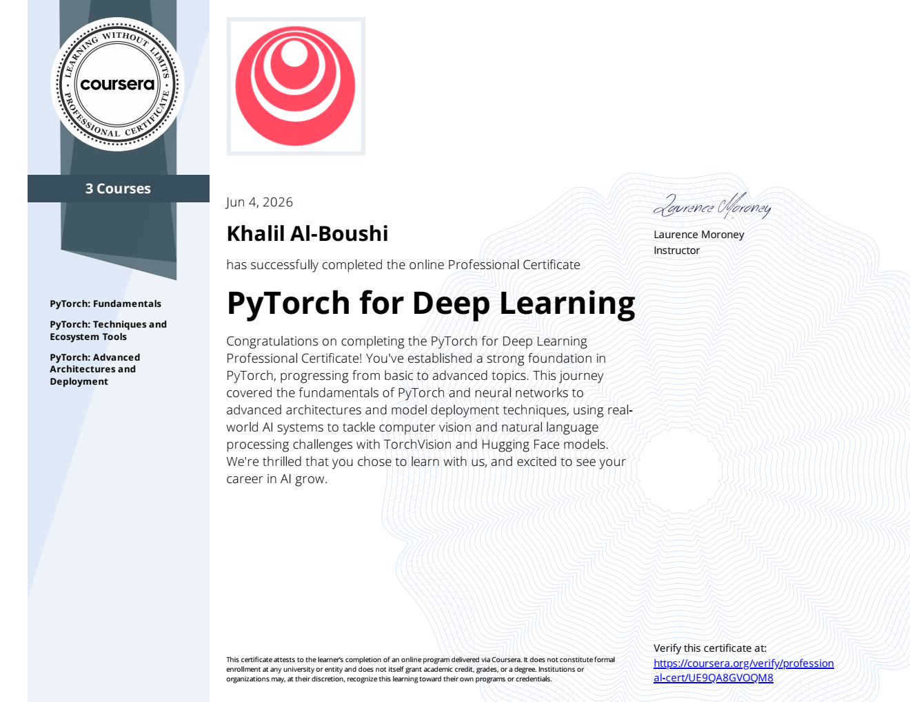

# PyTorch For Deep Learning - Course Labs

This repository contains my completed laboratory exercises, notebooks, and implementations from the PyTorch For Deep Learning course offered by DeepLearning.AI on Coursera.

## About The Course

This course covers the fundamentals of Deep Learning using PyTorch, including:

- PyTorch tensors and operations
- Automatic differentiation (Autograd)
- Neural Networks
- Training and Evaluation loops
- Loss functions and optimizers
- Computer Vision fundamentals
- Model building and experimentation
- Dataset handling and preprocessing
- Saving and loading models
- Deep Learning best practices

## Repository Structure

```text
.
├── C1
│   ├── C1_M1
│   ├── C1_M2
│   ├── C1_M3
│   └── ...
├── C2
│   ├── C2_M1
│   ├── C2_M2
│   └── ...
├── C3
│   ├── C3_M1
│   ├── C3_M2
│   └── ...
└── Certificate
    ├── certificate.pdf
    └── certificate.png
```

## Skills Demonstrated

- PyTorch Fundamentals
- Tensor Operations
- Neural Network Design
- Model Training
- Hyperparameter Tuning
- Data Loading Pipelines
- Model Evaluation
- Deep Learning Workflows

## Technologies Used

- Python
- PyTorch
- NumPy
- Matplotlib
- Jupyter Notebook

## Course Certificate

The course completion certificate can be found here:

📜 [View Certificate](./Certificate/certificate.pdf)

Or preview it below:



## Learning Outcomes

Through these labs, I gained practical experience in:

- Building neural networks from scratch using PyTorch
- Understanding gradient-based optimization
- Training and evaluating deep learning models
- Working with datasets and data loaders
- Applying deep learning concepts to real-world tasks

## Author

Khalil

AI Engineering Student

Interested in:
- Artificial Intelligence
- Deep Learning
- Computer Vision
- Large Language Models (LLMs)

## Acknowledgments

Special thanks to DeepLearning.AI and the course instructors for providing high-quality educational content and hands-on exercises.

---

If you find this repository useful, feel free to star it.